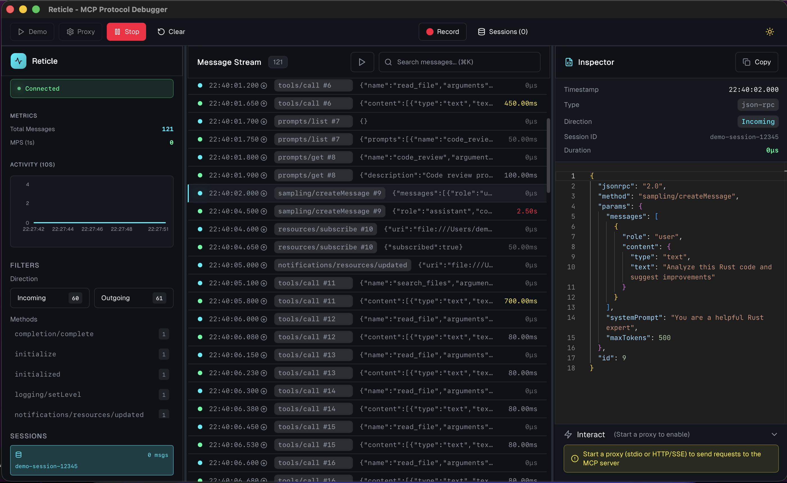

<h1 align="center">RETICLE</h1>

<p align="center">
  <strong>The Wireshark for the Model Context Protocol</strong>
</p>

<p align="center">
  <a href="https://github.com/labterminal/reticle/blob/main/LICENSE"></a>
  <a href="https://modelcontextprotocol.io"></a>
  <a href="#"></a>
  <a href="#"></a>
</p>

<p align="center">
  <em>See what your Agent sees.</em>
</p>

<p align="center">
  Reticle intercepts, visualizes, and profiles JSON-RPC traffic between your LLM and MCP servers in real-time — with zero latency overhead. Stop debugging blind. Start seeing everything.
</p>

---

## The Problem: Flying Blind

Building with MCP today feels like 1990s web development without a browser console.

| Pain Point | Reality |
|------------|---------|
| **Silent Failures** | Agents hang indefinitely when a server crashes over stdio. No error, no trace, just... nothing. |
| **Cryptic Errors** | `-32600 Invalid Request` tells you nothing about *why* the tool call failed. |
| **Context Bloat** | Connecting standard tools can waste 60k+ tokens just on definitions. Which server is the culprit? |
| **Security Anxiety** | You're running untrusted `npx` scripts that have full filesystem access. What are they *actually* doing? |

---

## The Solution: Reticle

<p align="center">
  
</p>

### Core Features

| Feature | Description |
|---------|-------------|
| **Deep Packet Inspection** | See raw JSON-RPC messages (requests, notifications, responses) in real-time. Syntax-highlighted with Monaco editor. |
| **Request/Response Correlation** | Automatically links responses to their originating requests. Jump between correlated messages with one click. |
| **Latency Profiling** | Color-coded latency indicators. Red (>1s), Orange (>200ms), Green (<50ms). Identify slow tools instantly. |
| **Token Profiling** | Real-time token estimation for every message. See context consumption per method, identify token-heavy tools. |
| **Stderr Capture** | Server crashes, Python tracebacks, debug prints — all captured and displayed separately from JSON-RPC traffic. |
| **Multi-Session Support** | Debug 10 MCP servers simultaneously. Filter by session, method, or direction. |
| **Session Tagging** | Add custom tags to sessions for organization. Filter sessions by server name or tags. |
| **Multi-Server Identification** | Each server is identified by name. Filter logs by specific server. |
| **Session Recording** | Capture complete sessions with timing data. Export to JSON for analysis or replay. |
| **Zero-Latency Proxy** | Microsecond overhead. Your agent won't even notice Reticle is there. |

### Transports

| Transport | Status | Use Case |
|-----------|--------|----------|
| **stdio** | Production Ready | Process-based MCP servers (Claude Desktop, Cursor, Cline) |
| **Streamable HTTP** | Production Ready | Modern MCP servers (2025-03-26 spec) with bidirectional HTTP |
| **WebSocket** | Production Ready | Real-time bidirectional communication with low latency |
| **HTTP/SSE** | Production Ready | Legacy web-based MCP servers (2024-11-05 spec) |

---

## Quick Start

### 1. Install Reticle

```bash
# Build from source
git clone https://github.com/labterminal/reticle.git
cd reticle
just build

# Or for development
just dev
```

### 2. The Wrapper Pattern

Instead of running your MCP server directly, wrap it with `reticle` (the CLI proxy):

**Before (Claude Desktop Config):**
```json
{
  "mcpServers": {
    "filesystem": {
      "command": "npx",
      "args": ["-y", "@modelcontextprotocol/server-filesystem", "/Users/me/work"]
    }
  }
}
```

**After (With Reticle):**
```json
{
  "mcpServers": {
    "filesystem": {
      "command": "reticle",
      "args": ["--port", "3001", "--", "npx", "-y", "@modelcontextprotocol/server-filesystem", "/Users/me/work"]
    }
  }
}
```

### 3. Open the Dashboard

Launch the Reticle desktop app. All traffic from your wrapped servers appears in real-time.

---

## Use Cases

### Debugging "Silent Failures"

Your agent tries to read a file but gives up silently. Reticle shows you the `fs.read_file` request resulted in a `Permission Denied` error that the agent swallowed.

```
[14:32:01.234] → tools/call  fs.read_file  #42
[14:32:01.289] ← error      -32602        #42  "Permission denied: /etc/shadow"
```

### Developing New MCP Servers

Don't write client code just to test your server. Use Reticle's **Request Composer** to manually send JSON-RPC payloads and verify responses.

### Multi-Server Debugging

Running Claude Desktop with 10 MCP servers? Filter by session to isolate one server's traffic. Color-coded status dots instantly show which servers are erroring.

### Security Auditing

Log every file access, shell command, and network request your AI agent attempts. Export logs to JSON for compliance auditing.

### Performance Analysis

Identify which MCP servers are slow. The latency column shows round-trip time for every request/response pair.

### Time-Travel Debugging

Record complete sessions and replay them later. Share session files with teammates to reproduce issues without re-running the agent.

---

## Client Configuration

### Claude Desktop

Edit `~/Library/Application Support/Claude/claude_desktop_config.json`:

```json
{
  "mcpServers": {
    "my-server": {
      "command": "reticle",
      "args": ["--port", "3001", "--", "python", "-m", "my_mcp_server"]
    }
  }
}
```

### Cline (VS Code)

In Cline's MCP configuration:

```json
{
  "mcp.servers": {
    "my-server": {
      "command": "reticle",
      "args": ["--port", "3001", "--", "node", "server.js"]
    }
  }
}
```

### 5ire / Other Clients

Same pattern — wrap your server command with `reticle`.

---

## Architecture

```
┌─────────────────┐     ┌─────────────────┐     ┌─────────────────┐
│   MCP Client    │────▶│     Reticle     │────▶│   MCP Server    │
│ (Claude, Cline) │◀────│    (reticle)    │◀────│  (your tool)    │
└─────────────────┘     └────────┬────────┘     └─────────────────┘
                                 │
                                 ▼
                        ┌─────────────────┐
                        │  Reticle GUI    │
                        │  (Tauri + React)│
                        └─────────────────┘
```

### How It Works

1. **reticle** wraps your MCP server process
2. All stdin/stdout traffic passes through the proxy
3. Messages are forwarded to the Reticle GUI via Tauri events
4. Zero-copy forwarding ensures microsecond latency

### Technology Stack

**Backend (Rust)**
- Tokio — Async runtime and zero-copy I/O
- Tauri v2 — Native desktop wrapper
- Serde — High-performance JSON serialization

**Frontend (TypeScript)**
- React 18 — UI framework
- Zustand — Lightweight state management
- React Virtuoso — Handles 10k+ messages without lag
- Monaco Editor — VS Code's editor for JSON inspection
- Recharts — Real-time metrics visualization
- Tailwind CSS — Utility-first styling

---

## Performance

| Metric | Value |
|--------|-------|
| Proxy Latency | <100μs overhead |
| Throughput | 1000+ messages/second |
| Memory | ~50MB baseline |
| UI Rendering | Smooth at 10k+ messages (virtualized) |

---

## Project Structure

```
reticle/
├── crates/
│   ├── reticle-core/       # Core library (protocol, token counting, storage)
│   └── reticle-cli/        # Standalone CLI proxy (publishable to crates.io)
├── src-tauri/              # Tauri desktop app (depends on reticle-core)
│   ├── src/
│   │   ├── core/           # Proxy implementations (uses reticle-core)
│   │   ├── commands/       # Tauri commands
│   │   └── main.rs         # Entry point
│   └── Cargo.toml
├── frontend/               # React + TypeScript UI
│   ├── src/
│   │   ├── components/     # LogStream, Inspector, Sidebar, etc.
│   │   ├── store/          # Zustand state management
│   │   └── App.tsx         # Main app
│   └── package.json
├── scripts/                # Python test utilities
│   ├── mock-mcp-agent.py   # Mock MCP client for testing
│   ├── mock-mcp-server.py  # Mock MCP server for testing
│   └── mock-mcp-sse-server.py  # Mock SSE server for testing
├── justfile                # Task runner commands
└── README.md
```

---

## Development

### Prerequisites

- Rust 1.75+
- Node.js 18+
- Python 3.8+ (for test scripts)
- [just](https://github.com/casey/just) (task runner)

### Available Commands

```bash
just          # Show all available commands
just setup    # Install dependencies
just dev      # Start development server
just build    # Build for production
just build-cli # Build CLI only
just test     # Run all tests
just check    # Check Rust code
just lint     # Run clippy lints
just fmt      # Format code
```

### Testing

```bash
just test-direct   # Test MCP server directly
just test-proxy    # Test with proxy
just test-stress   # Stress test (100 requests)
just mock-server   # Run mock MCP server
just sse-server    # Run mock SSE server
```

### Build for Production

```bash
just build    # Desktop app (macOS/Linux/Windows)
```

---

## Roadmap

### Completed
- [x] stdio transport (production ready)
- [x] Streamable HTTP transport (MCP 2025-03-26 spec)
- [x] WebSocket transport for real-time bidirectional communication
- [x] HTTP/SSE transport for web-based MCP servers (legacy)
- [x] Real-time message interception with zero-latency proxy
- [x] JSON-RPC parsing and syntax-highlighted display
- [x] Request/response correlation with one-click navigation
- [x] Latency profiling with color-coded indicators
- [x] Virtualized rendering (handles 10k+ messages)
- [x] Stderr and raw output capture
- [x] Multi-session support with filtering
- [x] Request Composer for manual JSON-RPC testing
- [x] Dark/Light theme with premium UI
- [x] Session recording (capture messages with timing)
- [x] Log export (JSON format)
- [x] Context token profiling per message and method
- [x] Session tagging for organization and filtering
- [x] Multi-server identification and filtering

### In Progress
- [ ] Log export (CSV/HAR formats)

### Planned
- [ ] Security firewall (block/allow specific methods)
- [ ] Traffic replay and request modification
- [ ] Session playback (replay recorded sessions)
- [ ] Multi-agent topology view
- [ ] npm/Homebrew distribution

---

## Troubleshooting

### No messages appearing?

1. Verify reticle is wrapping your server correctly
2. Check that the Reticle GUI is running and connected
3. Look at the terminal for error messages
4. See [TESTING.md](TESTING.md) for detailed debugging

### Proxy won't start?

1. Check if the port is already in use
2. Verify the command path is correct
3. Ensure the MCP server starts correctly when run directly

### UI not updating?

1. Open browser DevTools (F12) and check for errors
2. Verify Tauri event listeners are registered
3. Check that backend is emitting `log-event` events

---

## Contributing

Reticle is under active development. Key areas for contribution:

- Security firewall policies
- Traffic replay and session playback
- Log export formats (CSV/HAR)
- Token analytics and context profiling
- Multi-agent topology visualization
- Documentation and examples

---

## Acknowledgments

Built with [Tauri](https://tauri.app), [Tokio](https://tokio.rs), [React](https://react.dev), and the [Model Context Protocol](https://modelcontextprotocol.io) community.

---

<p align="center">
  <strong>Stop flying blind. See what your agents are doing.</strong>
</p>
